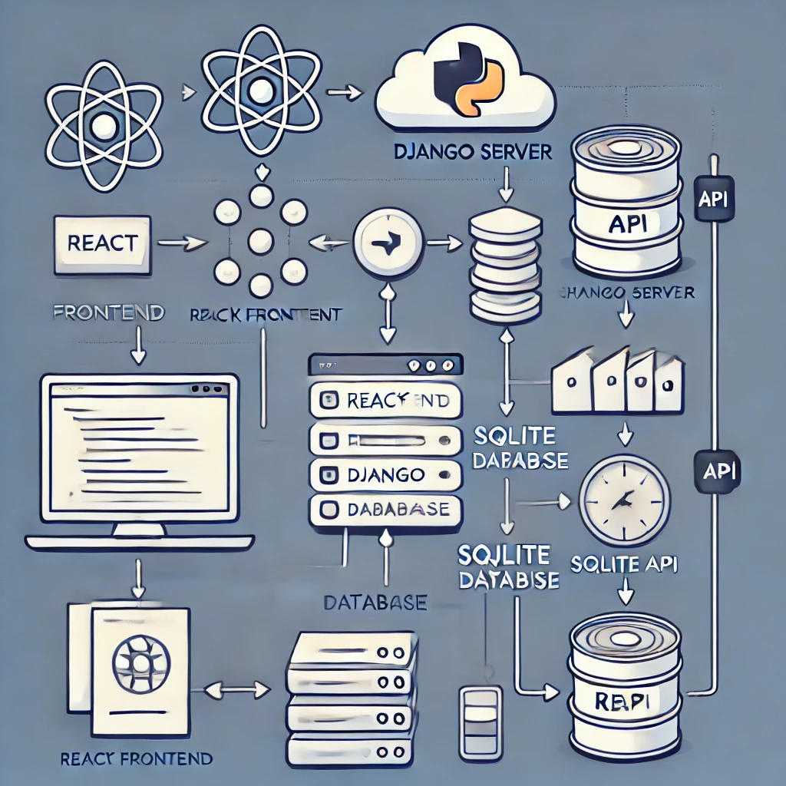

# Chat App
 
## Name: Navya Talwar

## University- IIT Jammu

## Department: Mechanical 

### ABOUT THE APP:

This project is a messaging service that provides real-time communication between users. Core features include user registration and authentication, individual chat functionality, and live message updates. It is built using Django for the web interface and Ionic React for mobile, following clean, intuitive UI principles such as Atomic Design. The backend is powered by REST APIs using Python with a choice of SQL databases. Clear documentation is provided for setup and system design. Optional features include audio/video calling.

## SYSTEM DESIGN:

HERE IS THE DIAGRAM REPRESENTATION:

We can divide system design in two parts:

##  1. HIGH-LEVEL SYSTEM DESIGN:

#### The high-level system design explains the architecture of the application at a broader level, including the interaction between major components. Here, the focus is on how the frontend, backend, and database communicate.

### OVERVIEW:

#### Frontend: Built using React to create an interactive, responsive user interface for messaging.

#### Backend: Django serves as the backend framework, handling user authentication, message management, and other business logic.

#### Database: SQLite is used to store data locally, which is suitable for development and small-scale applications.

#### Communication: The frontend and backend communicate using REST APIs over HTTP, where Django serves data to the React frontend.

### COMPONENTS:

### 1.Client (Frontend):

#### React App: Handles rendering UI and making HTTP requests to the server (Django).

#### Axios/Fetch (REST API): Sends HTTP requests to the backend for user actions (registration, messaging, etc.).

### 2.Server (Backend):

#### Django (Python): Manages APIs, user authentication, business logic, and message data processing.

#### Django REST Framework (DRF): Provides the RESTful API endpoints for the frontend to interact with.

## Database:

#### SQLite: Used to store users, messages, and chat groups locally within the Django project.

## ARCHITECTURE:

This architecture follows a standard client-server model.

#### Client: React App (Runs on the user's browser)

#### Server: Django (Python-based backend running on a web server)

#### Database: SQLite (Local database for storing app data)

## FLOW:

### 1.User Authentication:

#### React sends credentials to Django through a POST request.

#### Django validates user and returns a JWT token or session cookie.

#### Token/cookie is stored on the client side for authenticated API requests.

### 2.Message Sending:

#### React sends the message data via POST request to Django’s REST API.

#### Django processes the message and stores it in the SQLite database.

#### Django sends the updated chat history back to the React app via an API response.

### 3.Message Receiving (Real-time Updates):

#### Real-time updates can be achieved using a polling mechanism (React fetches updated chat data periodically), Django Channels, or WebSockets for real-time interaction.

# LOW-LEVEL SYSTEM DESIGN:

The low-level design focuses on the specifics of how individual components are implemented and how they interact in more detail.

## 1.Database Schema (SQLite):

define tables for your SQLite database using Django’s models. Below is an example schema:

### USER TABLE:

id: Primary key

username: String

email: String

password: Hashed password

### MESSAGE TABLE:

id: Primary key

sender_id: Foreign key to User (Who sent the message)

receiver_id: Foreign key to User (Who received the message)

message_content: Text

timestamp: DateTime of message sent

### 2.REST API Endpoints:

The Django backend exposes a number of API endpoints for the React frontend to interact with.

### Authentication Endpoints:

#### POST /api/register: Registers a new user.

#### POST /api/login: Authenticates the user and returns a token.

### Messaging Endpoints:

POST /api/messages/send: Sends a new message between users.

GET /api/messages/conversation/{user_id}: Retrieves all messages between the logged-in user and another user.

## SETUP INSTRUCTIONS

### 1. Prerequisites:

#### Before you begin, make sure you have the following installed:

Python (version 3.x)

Node.js (version 14.x or above)

npm or yarn (Node package managers)

Django (version 3.x or above)

SQLite (comes bundled with Python)

Git (optional for cloning repository)

 ### 2. Backend Setup (Django):

 >Clone the repository:
 
 Open your terminal and run the following:

#### git clone your-repo-url

#### cd your-repo-directory

>Create a Python virtual environment:

#### python3 -m venv venv

#### source venv/bin/activate  # On Windows use `venv\Scripts\activate`

>Install dependencies: 

#### pip install -r requirements.txt  # If a requirements.txt file is present

### If not:

#### pip install django djangorestframework

>Run migrations:

Set up the SQLite database with Django's built-in migration system.

#### python manage.py migrate

>Create a superuser: 

To access the Django admin interface, create a superuser account

#### python manage.py createsuperuser

>Run the Django server:

Start the backend server with the following command:

#### python manage.py runserver

Your backend API will be running at http://127.0.0.1:8000/

## 3. Frontend Setup (React):

>Navigate to the frontend directory:

If your React app is located in a subdirectory (e.g., frontend):

#### cd frontend

>Install dependencies: 

Install React and other necessary libraries like axios or fetch for handling API calls:

#### npm install

If you are using yarn, run:

#### yarn install

>Configure API URLs:

In your React app, ensure that the base URL for your backend Django server is set correctly. This could be configured in an .env file or within your API utility code. Example (.env):

REACT_APP_API_URL=http://127.0.0.1:8000

>Run the React development server: 

#### npm start

If you’re using yarn:

#### yarn start

#### Your frontend will be available at http://localhost:3000/

## 4. Integration (Connecting Frontend and Backend):

#### The React frontend communicates with the Django backend via REST API calls. These are typically made using libraries like axios or fetch in React.

#### Ensure that both servers (React on port 3000 and Django on port 8000) are running at the same time.

### The frontend interacts with the following API endpoints in Django:

POST /api/register - Registers a user

POST /api/login - Logs a user in

POST /api/messages/send - Sends a message

GET /api/messages/conversation/{user_id} - Retrieves message history

## 5. Testing the Application:

#### 1..Register a new user via the frontend or using Django admin at http://127.0.0.1:8000/admin.

#### 2.Login to the application through the frontend.

#### 3.Send and receive messages using the built-in chat interface.

## 6. Optional Deployment:

You can deploy the prototype on cloud platforms like Heroku, AWS, or Vercel. Here's an outline:

### Backend (Django):

Use Heroku or AWS Elastic Beanstalk for deploying the Django app.

Push your SQLite database to the cloud, or migrate to a production-level database like PostgreSQL.

### Frontend (React):

Deploy using Vercel or Netlify for easy CI/CD integration.

## 7. Libraries and Dependencies:

### Backend (Django):

#### Django: 
Main backend framework, provides easy handling of APIs and databases.

#### Django REST Framework (DRF): 
Extends Django to build RESTful APIs efficiently.

#### SQLite:
 Lightweight database for development, easy to use with Django's ORM.

### Frontend (React):

#### React:
 JavaScript library for building user interfaces.

#### Axios/Fetch: 
Library for making HTTP requests to the Django backend.

## CONCLUSSION:

#### This messaging service prototype demonstrates a robust and scalable system for real-time communication, built using Django for the backend, React for the frontend, and SQLite as the database. By leveraging REST APIs over HTTP, the application efficiently connects the user interface with backend services, ensuring seamless user registration, authentication, and real-time messaging.